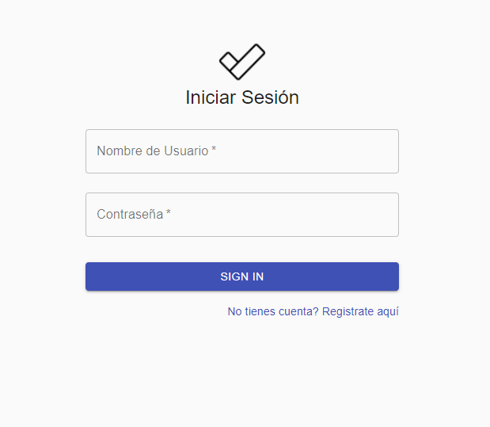

# django - React

<kbd>
  
</kbd>

 

 

### Requirements

> - BACKEND (Djagno Authentication Server)
>   - [Python 3.6](https://www.python.org/downloads/release/python-360/)
>   - [Django 2.2.3](https://docs.djangoproject.com/en/2.2/releases/2.2.3/)
>   - [Django REST Framework 3.10.1](https://www.django-rest-framework.org/)
>   - [Django REST Framework JWT 1.11.0](https://github.com/jpadilla/django-rest-framework-jwt)
>   
> 
> - FRONTEND (React Webapp Client)
>   - [React 16.5.2](https://www.npmjs.com/package/react?activeTab=versions)
>   - [React DOM 16.5.2](https://www.npmjs.com/package/react-dom)
>   - [Material UI](https://material-ui.com/)
>   
> 
> - Database
>   - [SQlite3](https://www.sqlite.org/docs.html)

### Backend End-points

> - Login
> 
>   |  HTTP |  Path |  Method |  Permission 
>   | --- | --- | --- | --- | --- |
>   |**POST** |/login|CREATE| None 
> 
> - User
> 
>   |  HTTP |  Path |  Method |  Permission |  목적 |
>   | --- | --- | --- | --- | --- |
>   |**POST** |/user|CREATE| Access Token
> 
> - Tareas - Task
> 
>   |  HTTP |  Path |  Method |  Permission |  목적 |
>   | --- | --- | --- | --- | --- |
>   |**GET** |/todo|LIST| Access Token 
>   |**POST** |/todo|CREATE| Access Token
>   |**GET** |/todo/todo_id|READ| Access Token
>   |**PUT** |/todo/todo_id|UPDATE| Access Token
>   |**DELETE** |/todo/todo_id|DELETE| Access Token 
> 